# 🛍️ Imaginary Product Store — Frontend Assessment

A modern e-commerce product browsing and product details experience built using **React + TypeScript + Vite** with a scalable domain-driven architecture and CI/CD automation.

---

## 🚀 Live Demo

👉 https://oolio-frontend-assessment-aslam-sol.vercel.app/

---

## 🧱 Tech Stack

| Layer            | Technology                               |
| ---------------- | ---------------------------------------- |
| Framework        | React 18                                 |
| Language         | TypeScript                               |
| Build Tool       | Vite                                     |
| Routing          | React Router                             |
| Styling          | Tailwind CSS                             |
| State/Data       | Zustand + Custom Hooks + Domain Services |
| CI/CD            | Jenkins + Vercel                         |
| Deployment       | Vercel                                   |
| Containerization | Docker                                   |

---

## 📚 Reusable Component & Utility Library

This project leverages a custom published npm package:

### 👉 **@aslam-dev/my-lib**

A reusable frontend utility and component library created to demonstrate scalable frontend engineering practices.

---

### ✨ Purpose

The library demonstrates:

- Component reusability across applications
- Encapsulation of shared business utilities
- Independent versioning and distribution via npm
- Strong TypeScript public API design
- Performance-focused UI components
- Real-world modular frontend architecture

---

### 📦 Library Features

#### Utilities

- Deterministic date formatting helpers
- Relative time calculations
- Phone number parsing & validation utilities
- Data transformation helpers (lodash wrappers)

---

#### Components

- `Note` → Lightweight reusable note UI component
- `BigNote` → Performance optimized lazy-rendered large content component using IntersectionObserver

---

### 🔗 npm Package

👉 https://www.npmjs.com/package/@aslam-dev/my-lib

---

### 🧪 Example Usage

```tsx
import { getCurrentDate, Note, BigNote } from "@aslam-dev/my-lib";

const Example = () => {
  return (
    <>
      <Note title="Today" content={getCurrentDate()} />
      <BigNote title="Performance Note" />
    </>
  );
};
```

## 📦 Features Implemented

### 🏪 Product Listing

- Search and filter products
- Sorting functionality
- Pagination simulation
- Deterministic product generation

---

### 📄 Product Details

- Image gallery with navigation
- Product configuration (color / size / quantity)
- Dynamic specifications
- Customer reviews generation
- Related product suggestions

---

### 📊 Assessment Progress Tracker

- Tracks resolved issues across pages
- Route-aware progress visualization
- Context-based global state

---

### ⚙️ Performance Optimizations

- Memoized selectors
- Deterministic seeded data generation
- Lightweight in-memory caching
- Lazy loaded routes

### 📘 E-Book Rendering Engine

- Large dataset block rendering (500+ blocks)
- Editable content blocks
- Drag & drop block reordering
- Custom block action callbacks
- Performance optimized rendering strategy

---

### 🔐 Authentication Module

- Login / Register flows
- Social authentication simulation
- Toast-based async feedback
- Form validation with UX safeguards

---

### ⚡ Rendering Performance Strategy

- Avoided synchronous UI blocking loops
- Controlled React Strict Mode safe state updates
- Memoized heavy derived computations
- Lazy block initialization
- IntersectionObserver powered rendering

---

## 🧠 Architecture Overview

The project follows a **Domain-Driven Modular Architecture**.

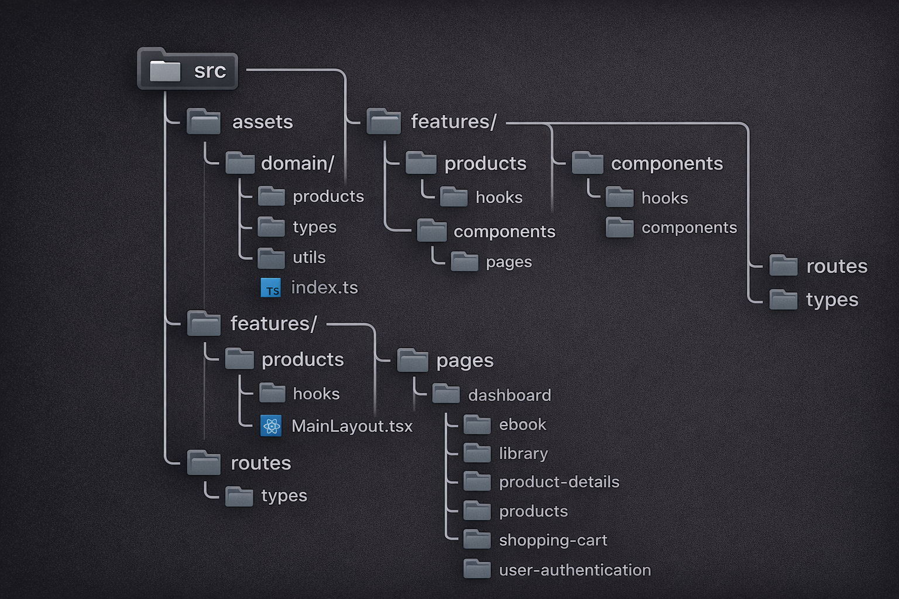

---

## 🧩 Design Principles

### Domain Isolation

Business logic is separated from UI rendering.

---

### Deterministic Mock Data

Products, reviews, and details are generated using seeded randomness to maintain consistent UI.

---

### Hook-Based Data Layer

Custom hooks act as data controllers, improving testability and reusability.

---

## ⚙️ CI/CD Pipeline

### Pipeline Flow

GitHub Push
↓
GitHub Webhook
↓
Jenkins Pipeline
↓
Build + Test
↓
Vercel Deployment

---

### CI/CD Tools

- Jenkins running inside Docker
- GitHub Webhook integration
- ngrok tunnel for local Jenkins
- Vercel CLI deployment
- Credential management via Jenkins

---

## 🐳 Jenkins Pipeline Stages

1. Checkout source code
2. Install dependencies
3. Build Vite application
4. Deploy to Vercel

---

## 🛠️ Running Locally

### Install Dependencies

npm install

---

### Start Development Server

npm run dev

---

### Build Project

npm run build

---

## 📁 Important Decisions

### Why Domain Structure?

Improves scalability and testability by separating UI from business logic.

---

### Why Seeded Generators?

Ensures consistent mock data across renders without needing a backend.

---

### Why Jenkins Instead of Only Vercel?

Demonstrates real-world CI/CD pipeline experience and automation.

---

## ✨ Bonus Implementations

- Dockerized Jenkins setup
- Automated GitHub webhook deployment
- Route-aware progress tracking system
- Reusable component library
- Fully typed domain layer

---

## 📌 Future Improvements

- Add unit testing
- Add integration testing
- Implement real API integration
- Add authentication flows
- Add analytics and performance monitoring

---

## 📸 App Screenshots

> Limited to only few pages due to the large number of pages and variations, but the live demo has the full experience!

### Dashboard

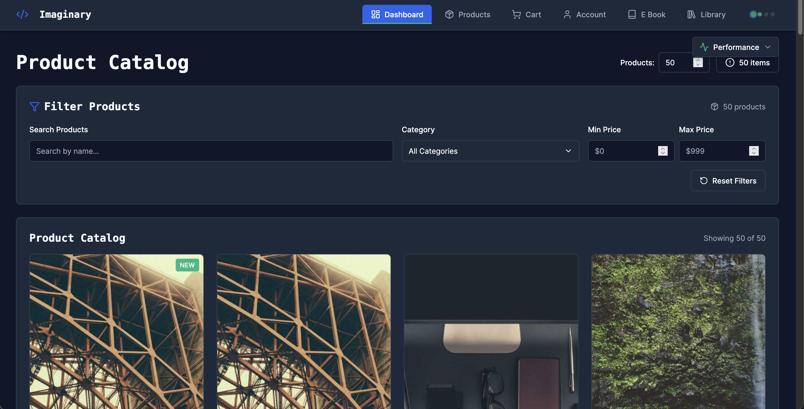

### Dashboard Mobile 📱

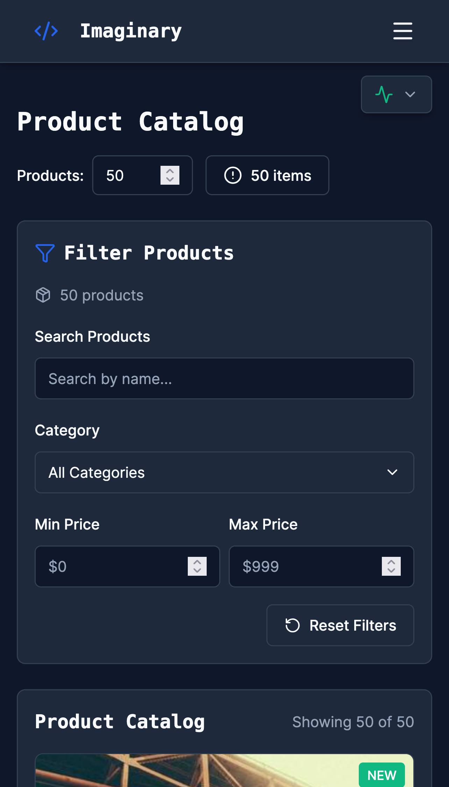
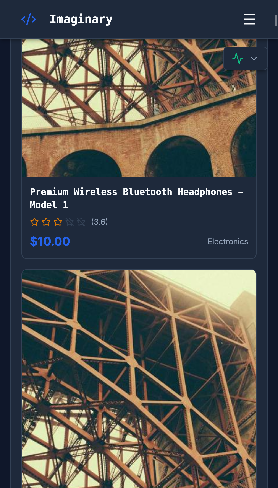

### Products

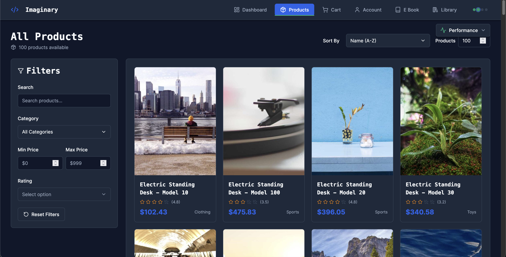

### Poducts Mobile 📱

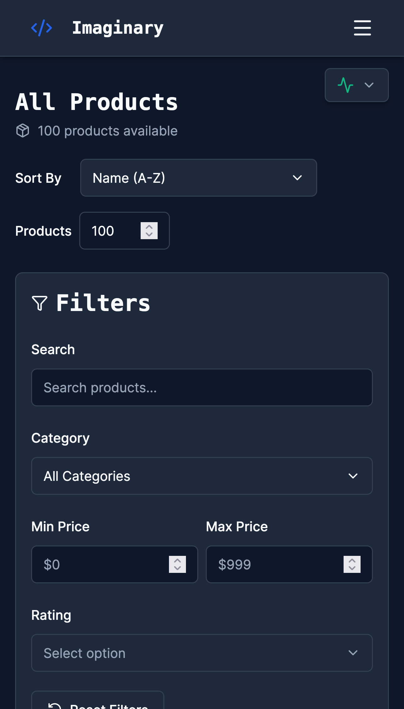
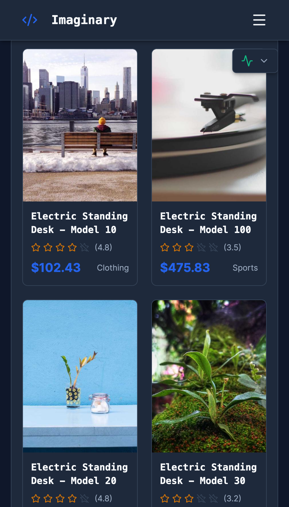

### Product Details

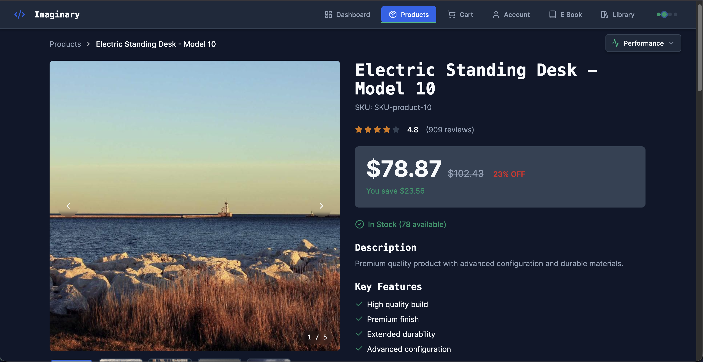
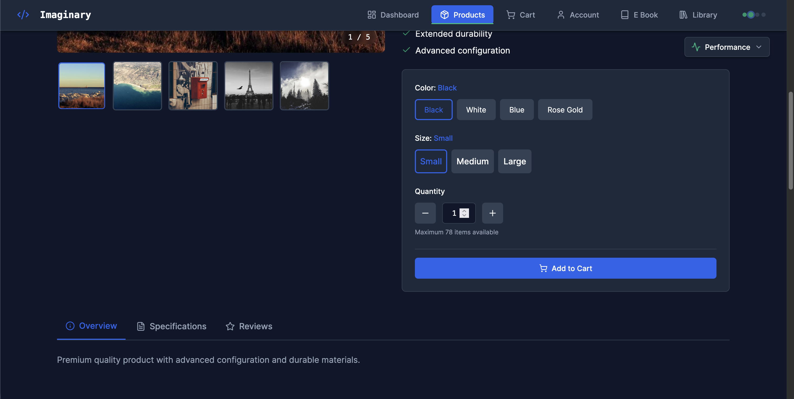
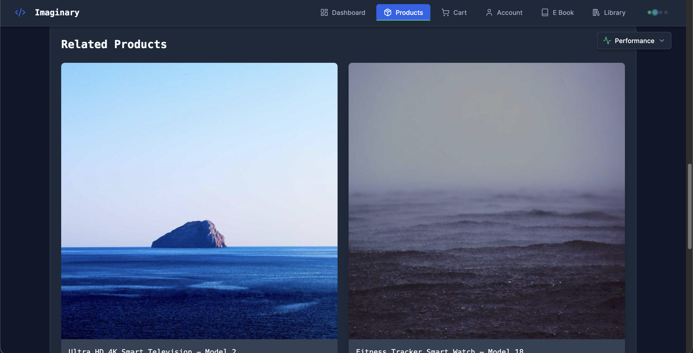
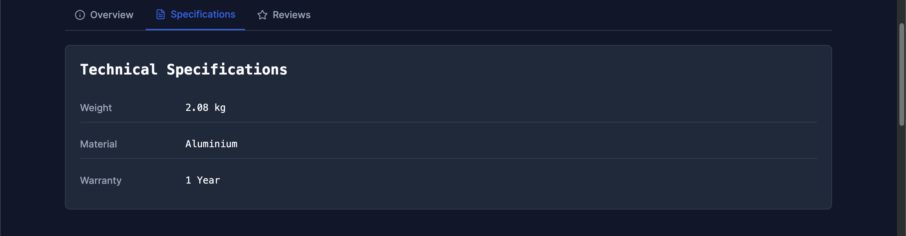
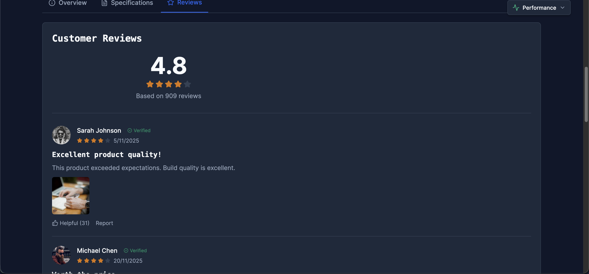

### Product Details Mobile 📱

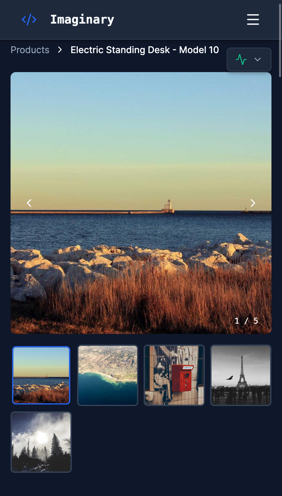
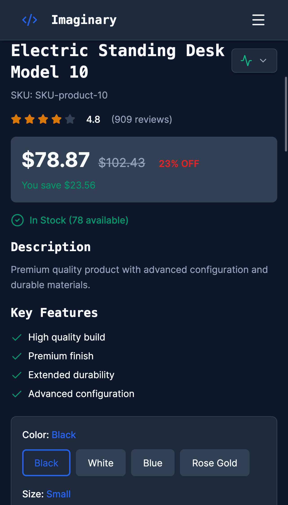
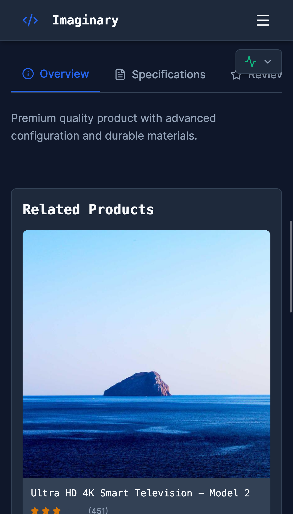
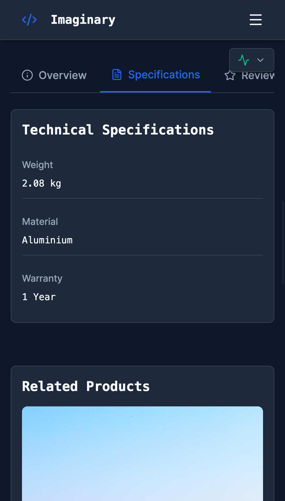
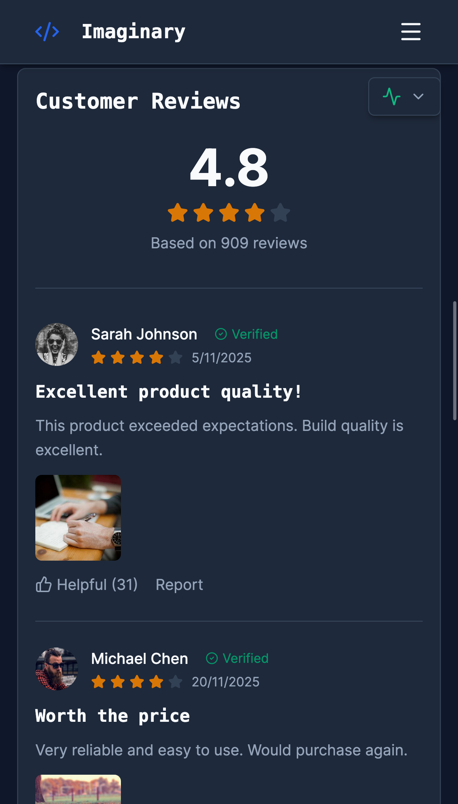

### Jenkins CI/CD Pipeline

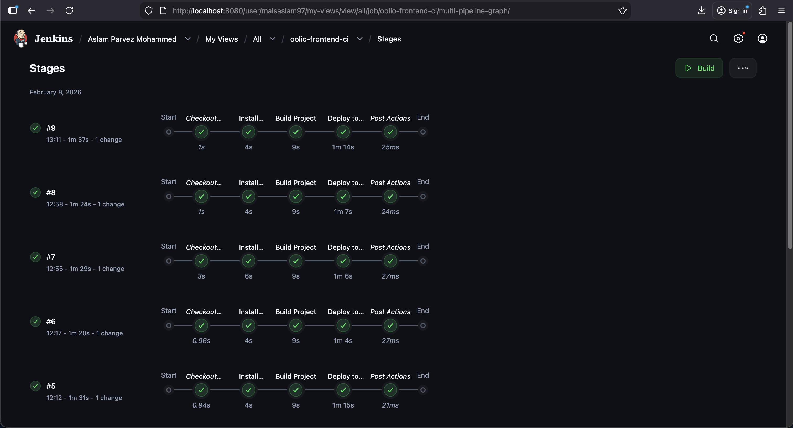

---

## 👨‍💻 Author (Base provided by Oolio)

**Aslam Mohammed**
